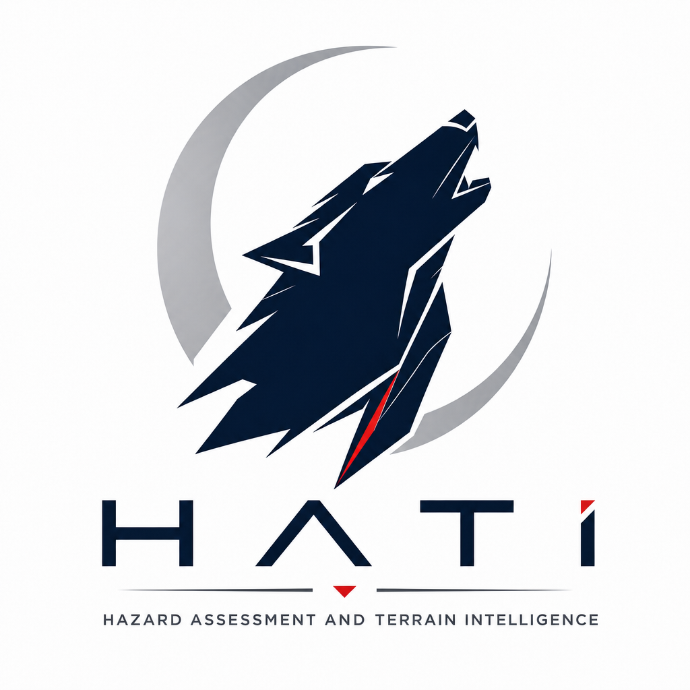
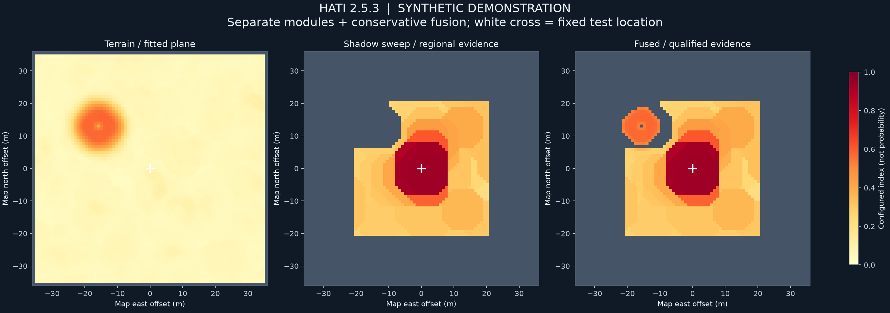

# HATI 2.5.3 — terrain, shadow sweep and fused hazard maps

11 September 2026 · deterministic research software · branch `feat/v2.0-heatmap`

HATI now exports the two physical modules separately and combines their evidence without averaging away a strong hazard. The additional DEM shadow predictor consumes the existing ISIS LROC NAC products and measured Sun geometry. It does not change the ISIS camera shape model, invoke ISIS, download imagery or require another ingestion.

The implementation targets regional hazard ranking. Its indices are not probabilities of mission loss, object classification or landing clearance. The Athena result must be measured on the stationary machine's saved prelanding sweep; no positive result is assumed or tuned into the counterfactual.

## Run on the stationary machine

Use the checkout containing the completed ingestion, including `data/sweep/manifest.json`, projected cubes and `.geom.json` sidecars. Adjust the first line to your checkout location.

```bash
cd ~/HATI_V2.0
set -euo pipefail
git switch feat/v2.0-heatmap
git pull --ff-only origin feat/v2.0-heatmap
conda activate isis
python -m pip install -r requirements-science.txt
bash scripts/run_landing_maps_wsl.sh
```

The environment name is retained for continuity with the completed run; the postprocessing script never executes ISIS. It runs seven offline test suites, then registration-error assumptions of 0.25, 0.5 and 1 pixel. Each scenario writes all three maps. The final comparison measures spatial root correspondence and index/threshold changes; equal candidate counts alone do not establish stability.

The default window is 512 × 512 NAC pixels, approximately 461 m across at 0.9 m posting. Every interior four-pixel analysis cell is searched, with fitting halos across tile boundaries. There is no image-wide candidate cap. The patch border and unsupported cells remain explicit. This is systematic coverage of the requested window, not a claim to survey the entire landing region. `HALF=512 bash scripts/run_landing_maps_wsl.sh` requests a 1024-pixel window if it fits every manifest frame's ingested window. Runtime grows with area and the number of distinct local slopes. This is CPU code, even on a GPU machine.

For a single scenario or a verified vehicle configuration:

```bash
python scripts/landing_maps.py \
  --half 256 --registration-sigma-px 0.5 --noise-sigma 0.03 \
  --config configs/landing_illustrative.json \
  --output output/athena/landing_maps_v253/single
```

## Three separate deliverables

| Product | Meaning |
| --- | --- |
| `terrain_hazard.tif` and `.png` | Configured DEM slope/height-relief index, buffered over the navigation margin |
| `shadow_hazard.tif` and `.png` | Regional moving-shadow evidence, buffered over footprint radius plus navigation margin |
| `fused_hazard.tif` and `.png` | Conservative maximum; incomplete low evidence remains unknown |
| `three_maps.png` | Side-by-side comparison using the same fixed 0–1 colour scale |
| `fusion_status.tif`, `observability.png` | Unknown, both modules qualified, or high evidence with incomplete assessment |
| `terrain_qualified.tif`, `shadow_qualified.tif` | Model support after footprint/navigation treatment |
| `dem_*m_*.tif` | Native DEM measurements at each recorded physical baseline |
| `dem_frame_*_*.tif` | Nominal/uncertainty-envelope visibility, horizon support and local incidence |
| `shadow_score.tif`, `shadow_required_contrast.tif` | Raw likelihood score and conditional template sensitivity |
| `shadow_status.tif`, frame count, common fraction | Why each regional cell could or could not be assessed |
| `candidates.csv` | Uncapped, spatially deduplicated high-evidence roots and per-frame fit contributions |
| `site_ranking.csv` | Regular candidate centres ordered by nominal evidence, with qualification kept separate |
| `counterfactual.json` | Fixed touchdown index, configured threshold flag and descriptive/qualified percentiles |
| `run.json` | Configuration hashes, source manifest hash, geometry, provenance, coverage and limitations |

All three main GeoTIFFs share the NAC reference grid and CRS. DEM diagnostic rasters retain the original DEM grid. Upsampling their display does not create finer terrain measurements. Grey is missing/unsupported evidence. A value of 0.5 is a configured threshold, not a 50% hazard probability. Separate module maps retain descriptive low evidence even when it cannot qualify for fusion; consult their qualification layers.

## Physical changes

**Terrain.** Circular windows fit `z = a·row_distance + b·column_distance + intercept` by exact least squares on complete native DEM samples. Outputs include plane slope, RMS vertical residual, maximum positive and negative residual, and the 95th percentile absolute residual. The score uses the maximum of slope, RMS, positive-relief and negative-relief ratios to their configured limits; `index = ratio / (1 + ratio)`. Multiple baselines remain separate diagnostics. The primary footprint baseline controls the index; a large-scale slope diagnostic is not silently fused as a second independent observation.

The shipped configuration is explicitly illustrative: 8 m footprint, 5 m navigation margin, 8° slope limit, 0.5 m RMS limit and 1 m signed-relief limit. These are **not verified Athena limits**. A fitting diameter must span at least four DEM postings. On the 4 m Nobile DEM, the 8 m footprint therefore uses a recorded 16 m descriptive baseline and remains unqualified for a low-hazard footprint conclusion. A fitted plane also does not solve actual footpad contact, clearance or stability.

**DEM shadow prediction.** Rays follow the measured map-frame solar bearing through original DEM samples, with bilinear heights along the ray, one-posting steps, lunar-curvature correction, local surface orientation and an approximate finite solar disc. A halo supports a finite 400 m default horizon. Missing ray samples cannot establish illumination; an observed complete blocker can establish shadow. Terrain farther away remains outside this model. Per-frame solar geometry is held constant over the analysis window.

The height scenario is ±2 × 0.5 m at each endpoint. It is a bounded assumed envelope, not a calibrated confidence interval or an independence assumption. At grazing illumination this envelope can remove most low-evidence qualifications. Nominal visibility still supports descriptive shadow fitting; conservative visibility qualifies the low-evidence interpretation. These fields expose uncertainty rather than turning it into a favourable score.

**Shadow sweep.** Every cell evaluates a regular root bank with heights 0.3, 0.6 and 1.2 m and widths 0.6 and 1.2 m. Template dimensions are model parameters, not measured crater or boulder sizes. Receiving slopes come from the DEM plane and are quantized to 0.005 m/m. Frame eligibility depends on availability and predicted illumination, never on whether a frame agrees with the hypothesis. All eligible frames share the same constrained contrast fit. Temporal static albedo and per-frame brightness planes are removed from both data and templates by the same operator.

A first-order albedo-gradient covariance accounts for small Gaussian alignment errors. The supplied registration sigma also broadens templates. This is an approximation to residual displacement, not a repair for wrong correlation peaks, large shifts or unmeasured spatially varying registration. The regional index is `score / (score + 8)`, where score is the square root of the constrained likelihood improvement. It is not an empirical significance or object density. The smallest-template required contrast is an expected-signal calculation, not injection-recovery completeness.

**Fusion and ranking.** A strong index survives fusion even if the other module is unavailable. Low indices enter fusion only with the recorded model support. Navigation/footprint disks take worst observed evidence; incomplete low evidence stays unknown. The disks operate on map pixel centres. Candidate-centre ranking remains descriptive and does not establish trajectory reachability. Counterfactual percentiles use half credit for ties and distinguish each module's available area from the commonly qualified comparison region. A flag at the fixed touchdown would support a terrain-hazard interpretation; it cannot prove prevention of mission loss or identify the cause of the landing outcome.

**Saved-product integrity.** Both root-search and map adapters read geometry sidecars directly. A missing sidecar fails instead of reaching the older `campt` fallback. Projected frame CRS and pixel axes must match the reference. Radiance resampling now rejects every output that contains an interpolated nodata contribution; a nearest-neighbour mask previously allowed some filled values into the observed region.

## Offline evidence

Seven suites passed on the laptop. New regressions compare curved-surface metrics against independent least squares, verify analytic ridge shadows and uncertainty envelopes, check the low-rank covariance against a dense inverse, exercise tile invariance and uncapped search, preserve native DEM impulses, reject interpolated nodata, verify fixed-location ranking and detect moved roots despite identical counts. A saved-product integration test writes all three georeferenced maps while external executable calls are forbidden. The real Nobile DEM/reference CRS and native postings were also inspected without ingestion.

The reproducible [regional benchmark](v253_regional_benchmark.json) uses eight fixed seeds per scenario, an independent 12× tapered-caster renderer, anisotropic blur and partly correlated noise on 40 × 40 synthetic scenes. It tests 96 scene/assumption combinations. The covariance/blur assumption of 0.25 pixel retained the injected 0.3 m × 0.6 m caster in all eight trials of each tested caster scenario, including 0.25-pixel jitter, higher noise and a four-frame 160° sweep. This small favourable synthetic exercise is not a lunar detection-rate estimate.

For static albedo with 0.25-pixel jitter, the unmodelled-registration setting produced 32 false retained roots across eight scenes; the 0.25-pixel setting produced five. With a caster and jitter, false roots fell from 24 to five while detections remained eight of eight. False roots therefore remain. Template blur and covariance change together here; this is not an isolated covariance ablation. The scoring threshold was not calibrated to a lunar false-alarm rate.

```bash
python scripts/benchmark_regional_shadow.py --seeds 8
python scripts/landing_maps.py --demo --registration-sigma-px 0.25 \
  --noise-sigma 0.012 --output output/landing_maps_demo
```



The remaining empirical work is on real prelanding products: inspect all three maps and unknown coverage, verify local registration and DEM/photometric uncertainty, compare scenario locations, and test independently annotated terrain and held-out sites. The software is ready for this run; a breakthrough in measured subpixel lunar sensing remains a result to establish.

## Scientific context

The distinction between local fitted terrain and true lander contact constraints follows the [JPL landing hazard analysis](https://ntrs.nasa.gov/api/citations/20150018785/downloads/20150018785.pdf?attachment=true). The slope/residual approach is consistent with the physical surface descriptors described in [JPL terrain analysis](https://robotics.jpl.nasa.gov/media/documents/aejAEROCONF2000.pdf). These references motivate the measurements; they do not validate the selected illustrative thresholds or HATI's new shadow detector.

The [2.5.2 assessment](V25_RELEASE.md) and branded Word audit report remain historical records of that release.
