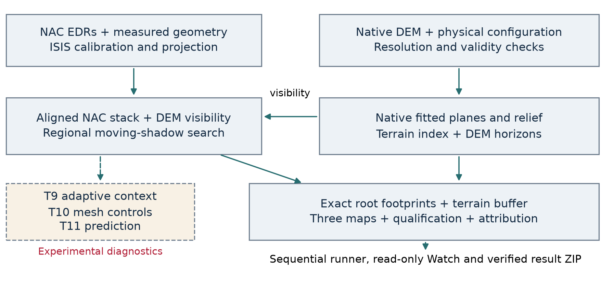
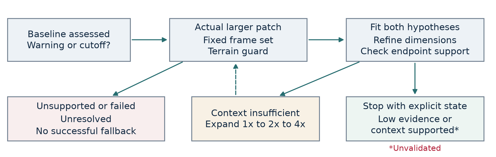
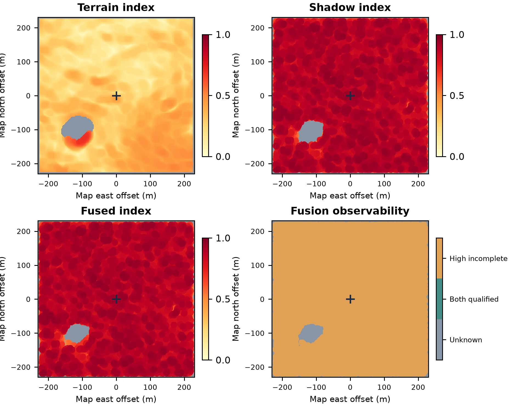
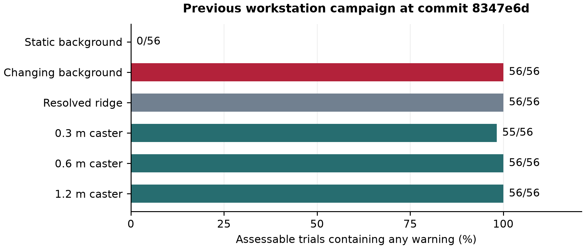

# HATI architecture and implementation review

## Deterministic lunar terrain and shadow evidence for landing site assessment

Technical dossier for scientific and engineering review

24 September 2026 | Document edition 1

Implementation snapshot **40cf64075c331e19d7fb57c4b2b4b3b4de17be66**

Core package version **2.5.5**, with the experimental adaptive extension committed on 23 September 2026. The commit, rather than the package version alone, identifies this architecture.

HATI combines native DEM measurements with evidence from repeated orbital images under different illumination. Its purpose is to identify terrain that deserves exclusion or further investigation and, eventually, to support defensible comparisons between landing regions poleward of 70 degrees latitude.

**Review conclusion.** The software now has a reproducible two-module architecture, explicit missing-data states, three separate map products and an experimental path for larger context and finer shadow hypotheses. Available evidence does not yet establish selective lunar subpixel detection, calibrated dimensions, landing clearance or reduced probability of loss of mission. The most pressing question is whether the shadow model can distinguish small casters from changing backgrounds and resolved terrain while retaining sensitivity.

Prepared for external technical feedback on the implemented system, its assumptions and the next validation decisions. Numerical results are identified by their source run. Proposed improvements are distinguished from existing code.

<!-- PAGE -->

# 1 Review scope and reading guide

The intended long-term outcome is a deterministic assessment that helps reduce terrain-related landing risk. The present deliverable is a research evidence system. It measures surface properties, ranks compatibility with a moving-shadow model and records whether the observations can support a low-evidence interpretation. It does not simulate the current vehicle, landing gear, attitude controller, descent trajectory or soil interaction.

The two scientific modules are complementary. **Terrain assessment** measures fitted-plane slope and residual height statistics on the original DEM grid. **Shadow assessment** searches aligned NAC images for a shared caster hypothesis whose predicted shadow changes with measured solar geometry. A third map conservatively combines their configured indices. Observability is exported separately; the three heatmaps alone are insufficient for interpretation.

The review covers the complete path from image ingestion to result packaging. The adaptive extension adds joint height/width refinement, larger real-pixel windows, an independent mesh renderer and withheld-illumination checks. It currently produces additional diagnostics and does not replace the baseline shadow map or feed new dimensions into baseline fusion.

| Reading objective | Sections |
|---|---|
| Understand the data flow and physical assumptions | 2 to 9 |
| Understand mapping, missing evidence and touchdown attribution | 10 to 13 |
| Review the adaptive implementation and independent controls | 14 to 17 |
| Review execution, provenance and measured evidence | 18 to 23 |
| Decide the next research priorities | 24 to 26 |
| Locate code, reproduce a run and inspect sources | 27 to 30 |

**Three evidence levels must remain separate.** An algorithm may be implemented and software-tested without being validated on lunar hazards. A synthetic recovery experiment measures performance under its declared scene generator. Independent field validation requires external truth, complete negative annotations and an evaluation protocol fixed before inspecting the results.

This dossier identifies the current implementation by commit 40cf640. The full workstation measurements described in Sections 20 to 22 belong to the preceding commit 8347e6d and the archive `athena-watch-01_results.zip`. The adaptive extension has local software, synthetic integration and small cached-data checks; no completed full adaptive workstation campaign was available for this review. [E1, E2]

<!-- PAGE -->

# 2 System architecture and software boundaries



The ingestion boundary is explicit. `ingest_sweep.py` executes ISIS on the Linux or WSL workstation. The scientific readers consume projected products, geometry sidecars or a verified portable array bundle. They do not invoke ISIS to fill missing metadata. The DEM horizon predictor is downstream of ingestion; it adds an illumination model without changing the camera shape model used by ISIS. [C01, C02, C04]

The core algorithms are ordinary Python, NumPy and SciPy functions. Rasterio and PyProj handle geospatial data; Matplotlib produces figures. The current scientific path needs no trained weights, Torch or GPU. The adaptive preset uses four CPU workers within T9, while campaign stages remain sequential. A larger graphics card does not accelerate these routines automatically.

Several older paths remain in the repository. The v1.5 TITAN/SCOUT learned detectors, early ten-channel logistic heatmaps and older connected-component shadow voting are not the active three-map engine. The `hati_core` package also retains an earlier descriptor API using RMS slope and TRI. `landing_maps.py` instead calls `landing_terrain.py`, `regional_shadow.py` and `root_footprint.py` directly. Old performance claims and stored cross-site descriptor AUCs do not validate this system. [C03, C07, C16]

The observer is outside the decision path: HATI Watch reads snapshots and artifacts. The campaign runner controls execution, saves provenance and packages evidence. Neither viewer activity nor candidate-display deduplication is meant to change scientific scores.

<!-- PAGE -->

# 3 Inputs and coordinate contracts

The Athena case uses a fixed test coordinate of latitude -84.7906 degrees and east longitude 29.1957 degrees, as encoded in the repository. These constants specify the retrospective test location; the code does not search for the location that gives the strongest warning. The reference image posting is 0.9 m, and the NOBILE03 DEM has 4 m native posting. A 512 by 512 image window therefore spans 460.8 m in map coordinates. [C01, E1, R03]

| Input | Required interpretation and checks |
|---|---|
| Projected NAC frames | At least three audited frames, matching reference CRS and pixel axes, finite measured shifts, pre-cutoff acquisition times |
| Geometry sidecars | Site-specific solar elevation and local bearing; matching site latitude and longitude |
| Native DEM | Original samples with a horizon/filter halo; square pixels and verified axis alignment with the image grid |
| Portable diagnostic bundle | Named arrays and JSON records; array hash, frame identity/order, geometry and grid consistency checked |
| Landing configuration | Physical distances and explicitly labelled illustrative limits |
| Campaign configuration | Frozen experiment grids, seeds, omissions, controls and adaptive settings |

Image rows increase downwards. The map-image solar bearing is measured clockwise from image up. A geographic bearing is transported through a one-metre geodesic step, the target projection and the inverse affine transform. This avoids assuming that geographic north equals image up near the pole. Slopes supplied to the caster model are derivatives of height along increasing image row and column, in m/m. [C05]

The raw-product reader checks square orthogonal reference pixels and the native DEM's orientation. The portable diagnostic reader is narrower: it requires square, north-up pixels. General coordinate helpers therefore do not imply that every command supports an arbitrary rotated raster. Raster index centres and affine pixel corners differ by half a pixel; exported root coordinates use the centre convention explicitly.

After alignment, each image is divided by its median finite positive intensity. Pixels that are nonfinite or nonpositive are unavailable. A frame with less than 80% positive coverage fails the raw-product load rather than silently disappearing. Normalization improves comparability, but it is not a calibrated bidirectional reflectance correction and can depend on the shadow distribution within the selected window. [C01]

<!-- PAGE -->

# 4 ISIS ingestion and image registration

The ingestion sequence is `lronac2isis`, `spiceinit`, a ground-point geometry check with `campt`, `lronaccal`, `lronacecho` and `cam2map`. It imports EDR data, attaches geometry, checks that the target lies on the detector, calibrates radiance, corrects the NAC echo effect and projects onto a shared lunar map grid. The echo correction follows calibration, consistent with the USGS application documentation. [C02, R01, R02]

Frame selection uses acquisition time, illumination coverage, viewing geometry and footprint checks. The `campt` check matters because a catalog footprint can refer to a stereo/channel combination that does not guarantee coverage by the downloaded detector channel. Geometry and processing identifiers are saved with the projected data. The current ingestion contract is `2026-09-audit-echo-v1`.

The counterfactual cutoff is **2025-03-06T00:00:00Z**. Excluding the entire landing day avoids relying on an assumed touchdown time. A normal scientific load requires every manifest entry to pass the processing-version, time and gate checks. This enforces image timing; by itself it cannot make a retrospectively developed method a prospective experiment.

Projected images are registered to the reference window. The raw displacement removes pointing error; the remaining residual and pairwise closure are separate diagnostics. The ingestion gate requires at least three retained frames, a median residual no greater than 1 pixel and a finite median closure no greater than 8 pixels. These are processing thresholds, not proof of subpixel alignment at every hazard. A small residual after fitting a shift can be partly self-confirming, which is why closure is also recorded. [C02]

Science reads the same validated window or a smaller one. Bilinear shift interpolation is accompanied by a bilinearly shifted validity mask. A retained output must have all contributing samples observed; filled values used internally must not become valid radiance. Local diagnostics later compare similar-illumination tiles, but do not automatically apply another registration correction.

**Review priorities.** Confirm actual ISIS kernel and shape-model labels, detector calibration, residual parallax and local alignment under low Sun. The global gate is too coarse to serve as a measured registration covariance. Inspect whether image-selection geometry provides independent information rather than simply more frames with nearly identical illumination.

<!-- PAGE -->

# 5 Native DEM terrain measurements

For each requested physical diameter, the terrain module fits a local plane in a circular window on the native DEM. Coordinates in the following equations are measured in metres. Every contributing sample must be observed; boundary padding and nodata filling cannot establish terrain support. The minimum supported diameter is four native postings. Convolutional moments provide the least-squares coefficients, while residual extrema and quantiles retain height information that slope alone cannot express. [C03]

```math
z_i = a r_i + b c_i + d + e_i, \qquad \theta = \arctan\!\sqrt{a^2+b^2}
```

```math
R_{\rm rms}=\sqrt{\frac{1}{n}\sum_i e_i^2},\quad R_+=\max(0,\max_i e_i),\quad R_-=\max(0,-\min_i e_i)
```

`relief_p95_m` is the 95th percentile of absolute residuals. RMS height measures departure from the fitted plane in metres; it is not RMS slope. Positive and negative relief capture protrusions and depressions relative to that plane. Their extrema remain separate from the percentile. A global height datum is subtracted before moment calculations to reduce floating-point cancellation.

The primary surface diameter is the greater of the configured footprint diameter and four native postings. Additional requested baselines are also raised to that support floor, deduplicated and exported. With 4 m posting and an 8 m requested footprint, the primary measurement uses 16 m and `footprint_resolved` is false. The 32 m and 64 m contexts are measured too, but the current terrain hazard index uses the primary scale.

```math
q_T=\max\!\left(\frac{\theta}{\theta_{\max}},\frac{R_{\rm rms}}{R_{{\rm rms},\max}},\frac{R_+}{R_{\max}},\frac{R_-}{R_{\max}}\right),\qquad I_T=\frac{q_T}{1+q_T}
```

The illustrative limits are 8 degrees for slope, 0.5 m for RMS residual height and 1 m for either relief extremum. Thus index 0.5 means that at least one configured ratio reaches one. It is not a 50% hazard probability. Exported native-grid measurements are reprojected to the reference grid with nearest-neighbour sampling; this changes their display grid, not their physical resolution.

The fitted plane approximates surface attitude. It is not a solution for discrete footpad contact, belly clearance, tipping, leg stroke or bearing strength. Those require vehicle geometry and terrain information at the relevant scales. Negative relief can expose resolved depressions; the active shadow bank has no explicit subpixel crater model or validated boulder versus crater classifier.

<!-- PAGE -->

# 6 DEM support and uncertainty

Native posting, spatial resolution and vertical accuracy are different properties. A 4 m sample interval cannot establish an 8 m landing footprint at the four-posting support rule used here. Conversely, adding more pixels by interpolation cannot recover missing surface structure. These restrictions are particularly consequential where one hopes to infer sub-metre hazards from a coarse topographic reference.

The NOBILE03 product documentation reports 4 m posting, a 3.7 m SOCET SET precision statistic and 0.42 m RMS disagreement with LOLA tracks. The last statistic includes contributions from both datasets. Neither number is automatically the local, spatially correlated vertical uncertainty needed for a horizon or footpad calculation. The confidence map is categorical: values 10 to 14 denote successful correlations, 4 denotes interpolation/extrapolation and 15 denotes manual editing. Its codes must not be averaged as a continuous quality score. [R03]

The current horizon model uses an **assumed** vertical sigma of 0.5 m and multiplier 2. At two endpoints it adds a total height envelope of 2 times the multiplier times sigma. This is a conservative bounded scenario within the code, not an empirically calibrated confidence band. At very low solar elevations, a modest height envelope can invalidate much of the presumed illuminated support.

The product README also recommends the M1101097181 ortho for full DTM coverage. HATI's Athena reference is M1101075756. This does not establish a defect in the present cropped window, which has explicit coverage checks, but motivates an independent coverage and reference-registration comparison before transferring to a larger area. The same README lists possible seams, faceting and shadow-related artifacts. [R03]

| Issue | Existing handling | Remaining requirement |
|---|---|---|
| Missing DEM samples | Complete circular support and halo checks | Better observations where support is absent |
| Coarse footprint support | Effective diameter and qualification flag | Finer verified terrain or a justified unresolved-relief bound |
| Vertical uncertainty | Declared horizon envelope | Spatial error model with independent checks |
| Stereo confidence | Categorical diagnostic reader | Validated rules linking category and measurement uncertainty |
| Local-plane inadequacy | Adaptive gradient-departure guard | Terrain-aware receiving surfaces and their own validation |

The current three-map pipeline does not derive terrain limits or per-pixel height covariance from stereo confidence codes. A sensible improvement is to retain these categorical flags as provenance while estimating uncertainty from independent overlaps and control data.

<!-- PAGE -->

# 7 Resolved terrain shadow prediction

`dem_shadow.predict_visibility` estimates whether the known DEM permits sunlight to reach each position. It traces up-Sun at one-native-posting distance increments, samples bilinear neighbour heights and includes a spherical lunar curvature correction. The default horizon range is 400 m. Computation uses a halo before cropping to the science window. [C04]

```math
\alpha(s)=\arctan\!\left(\frac{z(s)-z(0)-s^2/(2R_{\rm Moon})}{s}\right),\qquad H=\max_s\alpha(s)
```

The local surface gradient adds a self-horizon estimate. Five weighted solar strips approximate partial visibility of the solar disc, with angular radius 0.266 degrees. Nominal, conservative and optimistic visibility use the nominal horizon and the two declared height-envelope scenarios. Incidence factor and ray completeness are exported as diagnostics.

An incomplete ray cannot prove illumination. A known blocker can establish full shadow even if more distant samples are unavailable, but the model still only covers the declared range. Terrain beyond 400 m is not shown to be irrelevant. This distinction is important near polar crater rims and at grazing illumination.

The baseline shadow search uses finite image pixels with nominal visibility at least 0.99. Conservative visibility is used separately to qualify a low-evidence interpretation. The horizon prediction therefore asks whether a pixel should be illuminated by resolved terrain before attributing its changing darkness to a small caster. It does not remove a synthesized DEM radiance image from the observed NAC image.

**Implementation boundary.** This module consumes the same measured solar geometry and native DEM used alongside the ISIS products, but is implemented in NumPy/SciPy. It does not rerun `cam2map`, reinitialize SPICE, change the ISIS camera shape model or construct a new stereo DEM. It supplements the existing pipeline.

**Open modelling questions.** Finite-range ray sampling can miss terrain between samples or beyond the halo. Bilinear heights do not resolve subgrid peaks. The scalar uncertainty envelope omits spatial covariance. Frame-centre solar geometry is held constant across the local window. Increasing horizon range, using higher-resolution terrain and checking mesh-based visibility are plausible tests; each should report its additional unknown coverage rather than silently replacing it with illumination.

<!-- PAGE -->

# 8 Subpixel shadow geometry and rendering

Subpixel sensing here means inferring evidence of relief whose body may be narrower or shorter than an image pixel through its spatially extended shadow and its changes between frames. It does not mean creating a higher-resolution photograph or directly resolving all dimensions of an object. At low solar elevation, a small vertical relief can cast a multi-pixel shadow, but the receiving slope strongly affects its length.

For a map-image Sun azimuth A, the down-Sun direction is d = (cos A, -sin A). If the receiving plane has gradient g = (a, b), its slope along that direction is beta = g dot d. A rectangular caster with equivalent height h has shadow length L:

```math
L=\frac{h}{\tan e+\beta},\qquad \beta=\boldsymbol{g}\!\cdot\!\boldsymbol{d}
```

The denominator must be positive. A nonpositive value is invalid finite-intersection geometry, not a very long clipped shadow. On flat terrain at elevation 3.5 degrees, 0.3 m relief produces about 4.9 m of shadow; 1.2 m produces about 19.6 m. These are geometric examples, not measured Athena objects. At 0.9 m posting they correspond to roughly 5.4 and 21.8 pixels.

The detector samples a rectangular shadow of independent height and width on a supersampled grid, integrates to pixels and convolves with Gaussian blur. Its five solar strips vary elevation across the disc. The default optical sigma is 0.6 pixels; template blur also includes the supplied registration sigma in quadrature. Extra rendering padding prevents a crop boundary from becoming an artificial blurred shadow endpoint. [C05]

The baseline patch is 25 by 25 pixels but its fitted disk has radius 6 pixels. A shadow may therefore leave the fitted support before leaving the extracted patch. Endpoint censoring records this loss of length information. The fitted width is a shadow-template width; it need not equal the width of a yawed irregular body.

**Review question.** Are the finite-Sun approximation, PSF and receiving-plane model accurate enough at the smallest tested scales? The blur term and registration covariance describe related uncertainty; their joint use needs an empirical audit for possible double counting. A finer parameter grid reduces discretization error only if the model and observations identify the parameters.

<!-- PAGE -->

# 9 Statistical model and constrained score

The null hypothesis represents static spatial texture plus frame-specific illumination structure. The alternative subtracts one moving-shadow template with nonnegative shared contrast. Let Y contain normalized radiance on common pixels, B the static image, P the frame-specific spatial background and T(theta) the rendered template for root, height and width. [C05]

```math
H_0:\ Y=B+P+\epsilon,\qquad H_1:\ Y=B+P-aT(\vartheta)+\epsilon,\quad 0\leq a\leq a_{\max}
```

Baseline P is a linear spatial plane. The adaptive default includes a quadratic surface with basis 1, r, c, r squared, rc and c squared. These nuisance terms are removed from data and every template using exactly the same weighted projection. Common spatial support makes temporal static-texture removal commute with the spatial projection. QR gives an orthonormal spatial basis; no alternating-fit convergence tolerance is involved.

Registration uncertainty is a first-order covariance from gradients of a smoothed static reference. The model adds two displacement modes to normalized image noise and applies their inverse-square-root covariance weighting using an SVD. Equal frame noise scales are required by this implementation. It does not estimate a new shift or repair a wrong correlation peak. The supplied noise sigma is 0.03 in the recorded Athena normalized-intensity configuration; it is an assumption, not a measured independent-pixel noise model.

After nuisance removal and covariance weighting, write the data and template as R and U. The amplitude and improvement are:

```math
\hat a=\operatorname{clip}\!\left(-\frac{\langle U,R\rangle}{\langle U,U\rangle},0,a_{\max}\right)
```

```math
\Delta=\max(0,-2\hat a\langle U,R\rangle-\hat a^2\langle U,U\rangle),\qquad S=\sqrt{\Delta}
```

Template energy must be positive and the retained-energy fraction relative to the unprojected normalized template must be at least 0.02. This prevents nearly nuisance-equivalent templates from being treated as informative. Signed per-frame improvements show supporting and contradictory observations; they need not all be positive.

S is a constrained fit-improvement ranking. Searching many correlated roots and shapes, estimating nuisance structure, uncertain noise and forward-model errors prevent interpreting S as a field-calibrated Gaussian significance. No probability conversion follows from taking its square root.

<!-- PAGE -->

# 10 Systematic search and root evidence

`assess_regions` visits every interior analysis cell; it has no image-wide top-candidate cap. Default cells are 4 by 4 pixels, processed within 64-pixel tiles with a patch halo. Each full cell tests 16 root positions with offsets -1.5, -0.5, 0.5 and 1.5 pixels along each axis. This is a fixed half-pixel-phase lattice, not a continuous root optimizer. A short boundary cell retains the prescribed bank and halo conventions. [C06]

The active regional shape bank is heights 0.3, 0.6 and 1.2 m crossed with widths 0.6 and 1.2 m: 96 root/shape hypotheses per full cell before eligibility checks. These are `RegionalConfig` values. The separate proposal-based `search_stack` function has different `ShadowConfig` shape defaults and a 150-proposal cap; it is not the production regional map path.

A frame is eligible when at least 85% of the fitting disk has finite image values and nominal DEM visibility at least 0.99. At least three frames must qualify. The intersection of eligible-frame support must occupy at least 80% of the disk. Slopes must be finite. The baseline rounds slopes to 0.005 m/m bins, allowing reuse of rendered template banks. The LRU cache retains eight banks, keyed by frame subset and slopes.

Each shape is rendered once on a padded canvas; root positions are obtained by exact integer crop translations. After applying the common nuisance/covariance operator, the code profiles over shape at **every sampled root** and retains those root scores. It also records a cell maximum and its parameters. Separate candidate deduplication simplifies the warning list, but the footprint map uses all retained root scores rather than only those candidate winners.

| Baseline status | Meaning |
|---|---|
| 0 | Unvisited border or outside the analysis interior |
| 1 | Assessed with eligible identifiable templates |
| 2 | Unavailable due to support, frame or geometry conditions |
| 3 | No eligible identifiable template |

Cell values are replicated for raster display. Replicated pixels and neighbouring cells are not independent detections. Candidate counts are not boulder counts or object density.

For sensitivity qualification, the smallest baseline shape is tested at the worst sampled root. Its projected template energy implies a required contrast to reach score 8. The default reference contrast is 0.6. This calculation assesses expected model signal; it is not empirical injection recovery or evidence of completeness over unsampled positions.

<!-- PAGE -->

# 11 Landing footprints and conservative fusion

The two modules are converted to configured indices with threshold 0.5, but retain different physical meanings. Terrain uses its largest normalized limit ratio. The shadow score uses S divided by S plus 8. These monotone transformations ease display; they neither calibrate probabilities nor make the physical quantities interchangeable. [C03, C07]

Terrain evidence is buffered by the navigation margin because the local terrain measurement already spans the requested footprint, or its explicit coarser substitute. Shadow roots are buffered by half the footprint diameter plus the navigation margin. With an 8 m footprint and 5 m margin, the latter radius is 9 m in map coordinates.

```math
I_S(x)=\frac{S_*(x)}{S_*(x)+S_0},\qquad S_*(x)=\max_{j:\ \|p_j-x\|\,p\leq R}S_j
```

Here p is image posting and p_j is a sampled root in pixel-centre coordinates. `buffer_roots` computes true distances from each sampled root to each output centre, using every root score before cell maxima or deduplication. Ties are resolved deterministically by coordinates. The controlling root and its score are exported. This replaced an earlier cell-replication footprint error. [C07, E1]

Low evidence requires complete supporting neighbourhoods. A known high warning can remain visible even when another part of the footprint is unavailable. Qualified module indices are fused by their maximum, avoiding cancellation of a strong warning by a low value in the other module:

```math
I_F=\max(I_T,I_S)
```

If evidence is incomplete and every available value is low, the fused value is unknown. Fusion status separately records unknown, both qualified or high evidence with incomplete assessment. The code makes no independence assumption between the DEM and image evidence; both can share data and modelling errors.

The three principal outputs are `terrain_hazard.tif`, `shadow_hazard.tif` and `fused_hazard.tif`, each with its own PNG, plus `three_maps.png`. Qualification, status and controlling-root layers accompany them.

**Limitations.** A discrete root disk is not a complete physical obstacle envelope. Estimated width, uncertain extent, landing heading and footpad geometry do not expand the current buffer. Map metres also carry projection-scale assumptions. Integrating object extent and navigation uncertainty is a future vehicle-specific decision layer, not a property of the existing maximum operation.

<!-- PAGE -->

# 12 Observability and the meaning of low evidence

A low map index is only useful if the module had a credible chance to observe the relevant hazard. HATI records support separately rather than converting unavailable pixels into zeros. This protects against presenting a shadowed, poorly registered or under-resolved area as attractive merely because the detector could not evaluate it.

Terrain qualification requires complete navigation support and a footprint diameter resolved under the four-native-posting rule. Shadow qualification requires an assessed cell, sufficient expected small-template sensitivity, conservative DEM illumination on common pixels and no qualifying broad-darkness discrepancy. The shadow qualification mask must hold throughout the footprint-plus-navigation disk. [C03, C06, C08]

| Information state | Separate evidence map | Fusion interpretation |
|---|---|---|
| Both modules qualified | Measured indices retained | Maximum index with status 1 |
| Known high warning with incomplete support | High evidence retained | Warning with status 2 |
| Available low evidence but missing qualification | Descriptive value may remain visible | Unknown with status 0 unless the other module warns |
| Neither module available | NaN or unavailable | Unknown |

Status 1 means that the **implemented model qualifications** pass. It does not mean that physical hazard detection or vehicle clearance has been independently established. Model adequacy, noise assumptions, DEM accuracy and negative controls remain relevant even within qualified areas.

The site-ranking CSV samples alternative centres on a regular grid, ordered by ascending nominal maximum of the two separate buffered indices. It carries `both_modules_qualified` separately. It can therefore list descriptive alternatives whose assessment is incomplete. A consumer must not interpret the first row as a recommended landing point without checking that flag and the additional mission constraints.

No path planning, fuel budget, terminal guidance, communication, illumination duration, thermal limit, footpad stability or soil mechanics enters that ordering. Operational deployment would require these as explicit constraints or models rather than silently treating the lowest index as safe.

For future calibration, report both conditional performance on assessed locations and total hazard recall with unavailable positive locations counted as missed or unresolved. Denominators matter: refusing difficult scenes can improve a conditional score while reducing the area on which useful guidance is possible. The existing T8 recall already includes unknown positives in its denominator; its false-alarm fraction is conditional on assessed annotated negatives.

<!-- PAGE -->

# 13 Scene diagnostics and the Athena counterfactual

The broad-darkness diagnostic asks whether the images contain extended dark structure where the nominal DEM predicts illumination. Darkness is at most 20% of each frame's finite positive median. A connected component must contain an observed inscribed core of at least 4 pixels diameter. A pixel needs at least three nominally lit frames for assessment and a qualifying discrepancy in at least two. Image edges and missing samples do not extend the dark component. [C08]

This flag can respond to albedo, unresolved topography, registration or radiometric mismatch. It is not a crater classifier or a new calibrated hazard probability. It blocks a qualified low-shadow interpretation while preserving existing high warnings. The absence of a discrepancy does not prove that the physical model is adequate.

Local registration diagnostics select frame pairs within 8 degrees azimuth and 1 degree elevation. High-pass filtered tiles are compared over integer shifts within 6 pixels using one conservative common mask for every shift. Output includes correlation, competitor-peak separation, boundary status and unsupported tiles. The returned offset samples the second image at r plus dr, c plus dc; it is not automatically a correction to apply or an uncertainty sigma.

The fixed-location counterfactual reports the terrain, shadow and fused indices at the Athena coordinate, together with qualification and attribution. It distinguishes the direct raw cell from a root whose footprint buffer reaches the location. Percentile rank among fully qualified pixels is only available if a valid comparable region exists. A descriptive percentile over available module values is a different statistic. [C09]

The scientific question is whether prelanding data would support a **selective and independently defensible warning** at that location, compared with relevant alternatives. An everywhere-high map trivially flags touchdown without demonstrating useful discrimination. Even a localized hazard would not, by itself, prove that it caused the observed outcome or that a different decision would have prevented mission loss.

Retrospective methodology can still be useful, but the known touchdown must not supply threshold tuning, shape selection or a success criterion after inspection. A stronger test would freeze settings on development data and evaluate additional predeclared sites, including complete negative annotations and reachable alternatives. This requirement remains after the new adaptive implementation.

<!-- PAGE -->

# 14 Adaptive region requests and true context expansion

The adaptive extension is a separate experimental branch of the analysis, not a replacement production map. It starts from the baseline and records explicit reasons for revisiting cells: a score of at least 8, a predicted censored endpoint or missing predicted endpoint support. Baseline-unavailable cells do not become assessed simply because a neighbouring region is queued. [C10]

Within each processing tile, if at least 25% of assessed cells have predicted cutoffs, all assessed cells in that tile receive context checks. Adjacent requests are merged into scheduling/display regions. Cells retain their own original root bank: a merged region is not fit as one enormous rock, and overlapping requests do not create independent observations.



Passes use actual image windows of 25, 49 and 97 pixels, with fitting-disk radii 6, 12 and 24 pixels. Increasing the window reads more aligned pixels. It does not upsample the original patch. The first experimental pass fixes the eligible frame set; expansion cannot discard a contradictory frame because it becomes inconvenient.

At each pass, the maximum change of receiving gradient within the disk is multiplied by the physical fitting radius. This departure proxy must remain at most 0.15 m. It is a declared local-plane validity guard, not a calibrated terrain-error estimate. An image edge, lost frame support, missing terrain or excessive departure stops the cell as unresolved. A failed final pass cannot fall back to earlier dimensions and present them as a successful expanded fit.

The queue has deterministic spatial order. The workstation preset has no cell cap; if a cap is explicitly configured, unprocessed cells remain queued. Four workers process bounded outstanding jobs, but results and checkpoints are emitted in queue order. This is reproducible scheduling, not an assurance that floating-point values are identical across all machines and library versions.

<!-- PAGE -->

# 15 Joint dimension refinement and stopping rules

Each adaptive pass compares the same nuisance family and common observations for H0 and H1. The default quadratic background is deliberately more flexible than the baseline linear plane. It may suppress structured-background scores, but it can also remove genuine small-caster signal. Retained sensitivity must therefore be measured alongside any reduction in warnings. [C05, C10]

The coarse bank has heights 0.1, 0.3, 0.6, 1.2 and 2.4 m and widths 0.2, 0.6, 1.2 and 2.4 m. For a coarse best score of at least 8, the search fills neighbouring intervals around every compatible coarse height and width at 0.1 m spacing. Original knots are retained. All original root positions are tested; each height/width pair is profiled over roots. Streaming one rendered shape at a time bounds template memory.

Compatibility is the set of evaluated hypotheses within 4 improvement units of the best fit. Marginal height and width ranges are descriptive grid ranges. They are not confidence intervals. The surface is not an exhaustive dense grid everywhere: refinement can miss structure between coarse knots that did not enter the compatibility neighbourhood.

**Context-supported status requires all of the following:** the best score remains at least 8; every compatible model has predicted endpoint and beyond-endpoint support; compatible dimensions avoid the outer bank boundaries; both ranges span at most 0.4 m; and the best height and width differ by at most 0.2 m from the preceding pass. The minimum successful comparison therefore involves two scales. No maximum score is selected across different windows.

Endpoint checks use the two extreme solar strips and a background sample 2 pixels beyond the longest endpoint. They test patch bounds, the fitting disk and common observed pixels. They do not prove that an observed dark edge terminates there, and they do not verify the entire two-dimensional transverse shadow boundary. These are specific opportunities for a more complete physical consistency test.

Low-evidence fits keep their numerical argmax in the audit history but leave dimension maps blank. A last-pass assessed fit can still produce equivalent dimensions while its status remains unresolved, for example at a scale or bank limit. Consumers must read the status alongside the dimensions. No state is labelled validated.

A 10 cm sampling interval should not be reported as 10 cm accuracy. Root, width, height, contrast, receiving slope and blur can trade off. Multiple compatible models or absent endpoint information can prevent a useful dimensional conclusion even at arbitrarily fine grid spacing.

<!-- PAGE -->

# 16 Prediction under withheld illumination

T11 evaluates whether a fixed object inferred from training frames explains a withheld image better than a static background or incorrect solar geometry. This addresses a stronger question than whether re-fitting a large shape bank under the wrong Sun still finds some high score. Generic changing structure can warn under both geometries; physical dimension claims require more specific predictive evidence. [C10, C11]

Positions are placed on a fixed 128-pixel lattice inside the largest window. Every configured scale, every withheld frame and both linear and quadratic nuisance families are evaluated. T9's adaptive outcomes do not select the T11 locations or windows. With the 512-pixel Athena grid, 48-pixel largest radius, three scales and eight frames, the declared lattice contains 16 positions and 768 position/scale/background/frame trials before terrain and support exclusions.

At least four input frames are needed so that training retains at least three. Training intensities determine root, height, width, contrast and the static reference used by the registration covariance. Shared validity may use the withheld frame's observed mask, but its intensities do not select those parameters.

For the withheld image, all predictions use the same spatial nuisance projection and covariance weighting. A static baseline is estimated from the training images. The correct-shadow prediction uses the training object with the measured held-frame geometry. The wrong-direction prediction rotates only that held-frame azimuth by 90 degrees; it does not re-fit a different object to rescue the wrong model.

```math
E_k=\frac{1}{n}\sum_i\left(y_{\rm held,i}^{\rm proj}-\hat y_{k,i}^{\rm proj}\right)^2,\quad k\in\{\mathrm{static},\mathrm{correct},\mathrm{rotated}\}
```

The saved differences E_static minus E_correct and E_rotated minus E_correct are positive when the correct template predicts better. Invalid geometry and unsupported windows have explicit statuses and denominators. The held frame's spatial illumination coefficients are nuisance-fitted equally for every competitor; this is conditional residual prediction, not absolute radiometric forecasting.

Neighbouring windows and leave-one-frame-out fits share data. The trials are not independent field validation, and their medians do not supply a p-value or universal success threshold. T8 addresses separate annotated scenes, but currently evaluates the baseline regional engine only. Extending independent scene evaluation to the complete adaptive selection/stop procedure remains an important implementation task.

<!-- PAGE -->

# 17 Independent rock scenes and source provenance

The new control renderer uses triangulated solids rather than the detector's rectangular-shadow routine. Procedural rocks come from seeded convex hulls of 42 radial points. Optional OBJ sources provide measured laboratory shapes. The bundled catalog contains Apollo samples 10017,15 for development and 10021,79 for evaluation, with different parent-rock identities. It therefore contains only **one evaluation shape**, not a population-level morphology model. [C12, R04, R05, R06]

The catalog records source pages, original archive and OBJ hashes, metadata hashes, proxy hashes, credits and geometry assumptions. A 96-direction convex reduction limits triangle counts and removes concavities and fine detail. The loader checks local path containment, hashes, declared splits and duplicate parent identities or payloads across splits. It ignores material-file references; no remote texture loading occurs during inference.

`make_rock` imposes exposed height, body-axis width, aspect, yaw and burial. Its default burial fraction is 0.1; seeded yaw is random. These are declared simulation choices. Rescaling a returned lunar sample to a boulder does not establish a lunar size distribution. The recorded width is a pre-yaw body-axis extent, which differs from the detector's equivalent shadow width.

For each frame, triangles are clipped at the receiving surface and projected down-Sun onto a plane. A union of projected triangles produces shadow coverage. Seven centre/ring Sun samples vary both azimuth and elevation; pixels are integrated with sixfold supersampling in the workstation preset. Anisotropic optical blur, static texture, correlated noise and optional registration jitter differ from the detector assumptions.

T10 uses 0.2 to 1.2 m exposed heights in 0.1 m increments, two seeds, procedural and Apollo-derived shapes, overlaps, static and changing backgrounds, a ridge, missing context, registration stress and sloping-plane cases. Width is fixed at 0.6 m for the primary planted body and aspect at 1.35 in this preset. These tests do not yet span a joint population of true widths, aspects and burial depths.

Each scene gets a full baseline pass, then adaptive decisions in a predeclared central 3 by 3 cell region. The nearest predeclared target cell supplies dimension errors. The terrain-break case changes supplied slope fields after rendering a planar scene: it tests the guard's response to model inconsistency, not a physically rendered nonplanar landscape. Rock-body photometry, arbitrary terrain intersections, mutual illumination and multiple scattering are absent. Full-image false-alarm calibration is also outside these ROI trials.

<!-- PAGE -->

# 18 Sequential campaign and evidence products

The runner executes the software checks followed by map replay and T1 through T11. Stages have separate folders, logs, durations and artifact hashes. Scientific status is distinct from process exit status: a successfully executed experiment may be PARTIAL, and a missing prerequisite is BLOCKED. [C13]

| Stage | Implemented experiment and principal constraint |
|---|---|
| Maps | Reproduce separate terrain, shadow and fused maps using the native DEM |
| T1 | Baseline, signed frame contributions and independent static, changing-background, ridge and caster controls |
| T2 | Leave-one-frame-out and declared group omissions with frozen parent eligibility/common pixels; matched injections |
| T3 | Cyclic reassignment of measured geometry through the full search; stress test rather than exchangeable null |
| T4 | Optional thermal footprint aggregation and descriptive rank association; external CSV required |
| T5 | Expanded width bank, profiles and matched controls |
| T6 | Height profiles at declared supports and known-height/overlap controls; uncalibrated compatibility |
| T7 | Similar-illumination tile diagnostics and planted signed shifts; no automatic image correction |
| T8 | Separate annotated scene bundles; baseline cell recall, false alarms and unknown coverage |
| T9 | Adaptive region requests, expanding windows, joint dimensions and per-cell histories |
| T10 | Independent 3D scenes and complete adaptive decisions within fixed synthetic ROIs |
| T11 | Withheld-frame prediction on a fixed lattice across scales and nuisance families |

T4 records source, footprint bounds, rock abundance, uncertainty and valid coverage. It computes a descriptive Spearman association where possible. Overlapping thermal footprints are not independent. A thermal rock-abundance estimate is physically different from a sub-metre optical hazard label and cannot be converted into that quantity without a justified size and thermal model. [C11, R07]

T8 binds boolean hazard and annotation-completeness masks to each scene's array hash and rejects development or duplicate stacks. A cell is counted once and must be fully annotated. Unknown positives enter the recall denominator; unknown negatives are reported separately from the assessed-negative false-alarm fraction. Declared recall 0.9 and false-alarm fraction 0.1 are research targets, not vehicle safety requirements.

The current verdict function always withholds operational use. Even a fully completed campaign can at most be ready for scientific review. T9 to T11 deliberately retain PARTIAL status until calibration and independent evidence justify a stronger interpretation. Software success is never substituted for those missing requirements.

<!-- PAGE -->

# 19 Live observation and reproducible execution

HATI Watch is a read-only loopback HTTP server. It reads the selected run directory, displays input frames, processing status, current patches, predictions, residuals, scores, maps, logs and saved plots. It has no shell endpoint, job manager or science-control route. Paths are resolved within the selected run root, and POST requests cannot launch a computation. [C14]

`LiveFeedback` writes best-effort snapshots outside the numerical return path. The adaptive view distinguishes queued, unresolved, low-evidence and context-supported states. It shows actual patch size, scale, compatibility and endpoint reasons, and does not convert adaptive raw scores into a hazard probability. Synthetic scene coordinates are kept out of real Athena overlays.

“Live” means observable progress, not guaranteed updates for every internal hypothesis. With multiple T9 workers, per-cell observations are replayed when an ordered result becomes available. A slow earlier cell can delay display of later completed work. Cached cells report progress without pretending that a stale fit was just recomputed. Viewer delays do not alter results.

The campaign records source hashes, input hashes, package versions, arguments and configuration. Result subruns and adaptive cell checkpoints have signatures and checksums. Resume is permitted only when the recorded inputs, configuration and sources match. Ordinary interruption handling targets the runner's owned process tree, so worker computation should stop with the stage.

Completed evidence is packaged as a ZIP with relative paths, a per-file SHA-256 manifest, an archive checksum and `START_HERE.html`. It includes source code, the diagnostic input bundle, configuration, mesh payloads, logs and result artifacts. Native DEM, optional thermal and annotated-scene sources are identified and hashed, but are not all necessarily embedded. Exact map replay can therefore still require those external inputs; the ZIP is an evidence package, not a universal self-contained environment image.

Fixed seeds, queue order and thread limits reduce avoidable variability. They do not prove bitwise equality across CPUs, BLAS builds, Python versions or external ISIS services. Scientific dependencies currently use minimum versions rather than a locked environment. Recorded package versions permit audit, while a tested lockfile or container would improve controlled replication. A source hash proves identity, not physical correctness or independent scientific validation.

<!-- PAGE -->

# 20 Measured Athena maps and touchdown attribution

The following maps come from **athena-watch-01**, implementation 8347e6d. They are evidence for the preceding baseline, not a full result from the new adaptive extension. The source archive's 293 manifest entries and ZIP CRC were rechecked for this dossier. No ingestion or scientific stage was rerun to produce this figure. [E1]



The baseline assessed 14,324 of 14,884 analysis cells. Among assessed cells, 89.12% exceeded raw score 8. Every available buffered shadow-map pixel and every available fused-map pixel exceeded index 0.5. Availability was 96.04% and 96.42% respectively; these are coverage fractions, not rock occupancy or calibrated hazard probabilities.

At the fixed coordinate, terrain index was 0.3865 and shadow/fused index was 0.9292. The direct shadow cell was unassessed because common support was 76.11%, below the 80% requirement. A controlling sampled root 8.82 m from the exact test coordinate lay inside the 9 m footprint-plus-navigation radius. Broad image/DEM darkness discrepancy was also present.

No pixel had both modules qualified. The 8 m configured footprint was below the 16 m minimum surface diameter on the 4 m DEM. Therefore the supported result is a **regional warning at the touchdown coordinate**, not an independently localized touchdown object, selective counterfactual success or a safer-site recommendation. Improving the shadow map alone cannot resolve the terrain support gap.

<!-- PAGE -->

# 21 Measured sensitivity and changing background response

The same workstation campaign tested 72 planned trials per control scenario, combining nine locations and eight noise seeds. Only 56 were assessable: one location had missing slopes and another had invalid receiving-plane geometry. Counting only assessable trials without disclosing the planned denominator would overstate coverage. [E1]



The 0.3, 0.6 and 1.2 m casters were localized within two pixels in 55/56, 56/56 and 56/56 assessable trials, respectively. All 56 static no-caster trials stayed below threshold. Every assessable changing-background null produced a warning. Every ridge trial did too, but a ridge is actual simulated relief and may itself be hazardous; its response is not automatically a false hazard.

The changing-background control had no rendered caster. Its changing sinusoidal intensity term, texture, stain and noise expose a specificity failure under that test condition. This does not prove that all real warnings are false or estimate the lunar false-alarm rate. It shows that small-caster sensitivity alone is insufficient evidence of useful discrimination.

The structured-null maximum scores ranged from 16.32 to 21.52; the median maximum for the 0.3 m caster was 17.02. A post hoc threshold above every structured-null score would leave any warning in at most 4/56 small-caster trials. This is evidence of score overlap, not a proposed operating threshold. A stronger competing background/terrain model and prediction tests are therefore more promising than simply raising the cutoff.

The new quadratic alternative and independent mesh controls have been implemented to examine this issue. Their full workstation performance has not yet been established. The old 167/168 conditional recovery result must not be relabelled as 99.4% lunar accuracy.

<!-- PAGE -->

# 22 Geometry dimensions and registration evidence

Correct Sun geometry carried useful information in the previous run: the baseline median cell score was 24.94, versus 17.93 to 19.54 under seven cyclic geometry reassignments. Yet 83.86% to 86.12% of assessable cells remained above threshold under those reassignments. Persistence of warnings is compatible with generic changing structure; it does not validate dimensions. Cyclic reassignments are stress tests, not exchangeable permutation samples. [E1]

| Variant | Cells above score 8 | Median cell score | Small caster recovery |
|---|---:|---:|---:|
| Baseline | 89.12% | 24.94 | 55/56 |
| Remove RE frame | 88.34% | 21.40 | 51/56 |
| Remove declared low NCC pair | 81.03% | 17.38 | 48/56 |
| Add 2.4 m width | 90.70% | 27.86 | 55/56 |

Dropping frames lowered real scores and reduced matched small-caster sensitivity. It does not supply an independent quality criterion for discarding those images. The expanded width bank moved 89.09% of deduplicated warning roots to the newly added widest bin; such boundary migration motivates larger-structure tests but is not a measured body width.

Height profiles were assessed in 494 of 512 position/support cases. For isolated-caster controls, the imposed height belonged to the descriptive delta-score set in 42/144 assessable cases at 6-pixel support and 13/168 at 10-pixel support. These supports have different assessable cohorts, so the fractions are not a paired causal estimate of the effect of a larger window. They rule out interpreting those sets as validated confidence intervals.

Median height errors by truth height were -0.05 m for 0.3 m casters, -0.075 m for 0.6 m casters and -0.30 m for 1.2 m casters at both supports. These errors are conditional on the tested model mismatch and geometry, not a correction curve transferable to lunar data.

Planted integer registration shifts were recovered exactly in all 186 measured trials, but 2,740 of 2,926 tile trials lacked support. Only 30 real tile measurements existed across the eligible pairs and tested tile sizes, with offsets of zero or one pixel. The test establishes conditional integer-shift recovery, not subpixel registration accuracy or a regional sigma.

Finally, 40.81% of sampled baseline roots had zero score. Root-level median changes of zero after frame removal therefore conceal substantial cell-level changes. Future summaries should preserve cell-level paired comparisons and distribution tails rather than rely on one tied median.

<!-- PAGE -->

# 23 Software verification and current evidence limits

Local validation of the adaptive implementation passed 14 software suites, including 18 new tests dedicated to adaptive inference, its campaign integration and the independent rock renderer. A small sequential command-line campaign exercised map replay and T1 to T11, verified 286 result-file hashes and ZIP integrity, and reused all completed stages on resume. T4 and T8 remained blocked for missing external inputs; no science worker crashed. [E2]

| Property checked | Evidence and scope |
|---|---|
| Baseline preservation | All 16 pre-existing baseline arrays and candidate list matched prior committed code on a 56 by 56 cached Athena cutout |
| Expansion correctness | Actual larger pixels, fixed root grid and frozen eligible frames tested |
| Conservative failure | Lost coverage, image edges, invalid terrain and failed final pass remain unresolved |
| Predictive isolation | Perturbing withheld intensities does not change the training object or covariance reference |
| Reproducibility | Fixed-seed rendering, observer independence, serial/parallel agreement and verified checkpoint reuse |
| Renderer independence | Mesh generator tested without calling the detector renderer |
| Source separation | Catalog hashes, path constraints, parent identities and duplicate payload splits checked |
| Presentation | Adaptive viewer and saved-plot selection inspected without browser console errors |

Four cached cells near the fixed coordinate exceeded the new local-plane departure limit, with proxies about 0.20 to 0.29 m against the 0.15 m setting. They stayed unresolved. This small check reveals a real coverage concern for the planar model; it cannot quantify scene-wide adaptive recovery or justify relaxing the limit until touchdown passes.

The full new workstation preset still needs evaluation. In particular, no result here establishes that the quadratic null fixes structured-background warnings, that larger context improves dimensional coverage, or that correct held-frame geometry reliably predicts new observations. Software tests prevent known implementation mistakes; they do not settle these scientific questions.

A meaningful next result should publish request fractions, completed/unresolved states by reason, retained small-caster recovery, changing-background warnings, final dimension availability and error, compatibility inclusion, and prediction differences for every declared scale and nuisance model. Report missing trials and paired cohorts. The results may show that some scenes are fundamentally uninformative at this resolution, which is a valid outcome rather than a software failure.

<!-- PAGE -->

# 24 Prioritized architectural improvements

**First priority is model discrimination.** Finish the frozen adaptive campaign and compare linear/quadratic alternatives on matched controls and withheld images. Preserve weak-object sensitivity and unknown-area denominators. If changing-background responses remain large, investigate a resolved-terrain illumination model and explicitly competing ridge/crater/background explanations. An additional shape bank that merely increases the maximum score is not, on its own, progress.

**Second priority is independent field evidence.** Obtain several geographically and observationally distinct evaluation regions with independently produced hazard and complete-negative annotations. Separate tuning, calibration and final evaluation by scene, acquisition and object identity. Hash declarations are useful bookkeeping but do not prove independence of overlapping terrain or derived products. Extend T8 to evaluate the full adaptive procedure, including requests, stopping, missing outputs and multiple searches, rather than just its baseline engine.

**Third priority is physically adequate terrain support.** Establish a defensible DEM error model and either acquire footprint-scale terrain or carry unresolved relief into a conservative decision layer. Test a terrain-aware receiving surface when the plane guard fails. A piecewise plane, mesh ray tracer or DEM intersection model should be evaluated on independently rendered nonplanar controls before it replaces unresolved states. Reprojection alone cannot solve this issue.

These priorities lead to measurable decision gates. Adopt an alternative model only if it improves prespecified discrimination or predictive performance without hiding failed coverage. Adopt dimensions only after checking bias and uncertainty coverage across shapes, widths, viewing geometries and noise conditions. Integrate adaptive evidence into fusion only after defining how its scale-dependent scores are calibrated or used conservatively.

Later engineering work should add a reproducible environment lock, deterministic tie-breaking audits across platforms, performance profiles and integration tests on interrupted multiworker stages. GPU acceleration may be worthwhile for rendering or batched projections, but it should follow profiling and preserve baseline comparisons. Faster computation cannot resolve a non-identifiable physical model.

Landing decisions then require a verified vehicle configuration: footpad layout, allowable attitude, stroke, belly clearance, navigation error, contact mechanics and reachable alternatives. NASA's ALHAT work provides a useful architectural precedent for combining slope/roughness sensing with vehicle-scale site selection; its sensor performance or thresholds must not be transferred to HATI's orbital imagery. [R08]

These are proposed next steps. Arbitrary-terrain ray tracing, calibrated field probabilities, adaptive-map fusion and a current-vehicle contact model are not implemented capabilities of commit 40cf640.

<!-- PAGE -->

# 25 Additional physical metrics worth testing

The current measurements are a useful foundation. More metrics should be added only when they represent missing physics and improve independent predictions or hazard decisions. Several candidate quantities can be computed deterministically without learned weights; deterministic computation alone does not make their hazard interpretation correct.

| Candidate addition | Physical purpose | Data or validation requirement |
|---|---|---|
| Footpad contact and clearance | Estimate support-plane attitude, leg stroke and body clearance over actual vehicle contacts | Verified geometry, terrain at contact scale and unresolved-relief handling |
| Directional relief and roughness | Detect terrain anisotropy that a scalar RMS conceals; assess heading dependence | Fixed physical baselines, direction conventions and vehicle orientation tests |
| Multiscale residual structure | Separate broad resolved shape from smaller residual relief | Independent DEM error spectrum; no extrapolation of small-scale power without evidence |
| Terrain-predicted shadow residual | Explain broad darkness using measured topography before fitting a small caster | Validated nonplanar visibility, photometry and horizon uncertainty |
| Endpoint and edge consistency | Check observed continuation and termination against the frozen prediction | PSF-aware two-dimensional edge model and common observed background |
| Illumination identifiability | Quantify information gained from Sun directions and elevations | Profile curvature or sensitivity tests after nuisance projection, checked empirically |
| Thermal rock abundance | Independent surface-property comparison at thermal footprint scale | Valid polar retrievals, effective footprints and size-dependent interpretation |

Curvature, terrain position index, terrain ruggedness index and slope dispersion already exist in the older descriptor code. They are not additional independent measurements just because they have different names: all may derive from the same DEM samples and amplify the same errors. Adding them to an arbitrary weighted sum would increase apparent sophistication without establishing better landing discrimination. [C16]

For shadow dimensions, useful tests include broader true widths, aspect ratios, burial depths, concavity, rough receiving terrain, shadow overlap and registration/PSF perturbations. The present T10 preset varies heights densely but fixes much of the morphology distribution. More seeds alone do not substitute for more independently sourced shapes and scenes.

Thermal abundance is best treated initially as an external consistency check, not a third high-resolution hazard module. The cited Bandfield study restricts its retrievals to 60 degrees north/south because high-latitude slope temperatures can mimic rock abundance. It cannot directly validate Athena at 84.79 degrees south. A polar-specific retrieval and its effective footprint need separate justification; a thermal fraction does not identify a particular subpixel obstacle. [R07]

<!-- PAGE -->

# 26 Questions for scientific and engineering reviewers

Reviewers are asked to challenge the assumptions and propose tests that could falsify the intended interpretation. Feedback is most useful when it identifies the affected section, a concrete failure mechanism, the required evidence and an actionable experiment.

1. **Physical target.** Which terrain-related hazard classes can the present data identify: protrusions, depressions, ridges, roughness, broad model mismatch or a mixture? What observations would distinguish them?
2. **Native terrain support.** Is the four-posting plane rule appropriate for the intended footprint, and what uncertainty model can justify conclusions about unresolved relief? Which DEM artifacts could bias the reported slope or residual extrema?
3. **Radiometry.** Can median normalization and a linear/quadratic background represent the relevant changing lunar reflectance? Which photometric terms should enter H0 without erasing a true small-caster signal?
4. **Registration and PSF.** How should local image displacement, parallax and optical blur be measured? Do template broadening and covariance weighting appropriately represent distinct effects?
5. **Geometry.** When is a local receiving plane adequate, and what is the least complex validated replacement when it fails? How far must horizons extend at the tested elevations?
6. **Identifiability.** Under which Sun distributions can height, width, root and contrast be separated? Should output be a compatibility surface, bounds or only generic evidence when endpoints are censored?
7. **Adaptive selection.** Are requests and stopping conservative enough? How should calibration include the coarse-to-fine bank, window expansion and the possibility that a low first-pass score prevents a larger-window fit?
8. **Independent controls.** Which morphology, surface and illumination cases are missing? Can a separate renderer or measurement dataset expose errors shared by the present planar models?
9. **Validation unit.** Should evaluation be by object, cell, landing footprint or region? How should spatial dependence, incomplete labels and missing observations enter uncertainty and acceptance criteria?
10. **Counterfactual.** What predeclared comparisons would make a touchdown warning scientifically informative when the surrounding map is saturated? What additional evidence is needed before discussing avoidance of mission loss?
11. **Decision layer.** Which vehicle limits and reachable alternatives are essential before site ranking has operational meaning? Should navigation uncertainty use a bounded envelope or a separately validated distribution?
12. **Implementation review.** Which code invariants, numerical approximations or provenance gaps need adversarial tests before expanding the experiment?

Suggested feedback format: **section or code reference; concern; consequence; supporting evidence; proposed test; priority**. An unsupported claim should be narrowed, a model limitation should be measured, and an implementation defect should be reproducible. The aim is an informative detector with explicit uncertainty, not a predetermined positive verdict at Athena.

<!-- PAGE -->

# 27 Implementation entry points

The following references point to the immutable implementation snapshot used for this dossier. The editable evidence snapshot also records source hashes and top-level function/class line numbers. Repository paths are relative to the HATI root. [C00]

| Reference | Implementation and principal responsibilities |
|---|---|
| C01 | `scripts/sweep_products.py`, `scripts/sweep_contract.py`: read audited products, transport arrays, enforce temporal and processing contracts |
| C02 | `scripts/ingest_sweep.py`: select, download, calibrate, project and register NAC frames; emit manifest and closure evidence |
| C03 | `src/hati_core/landing_terrain.py`: physical support, plane metrics, configured terrain index and missing-aware fusion |
| C04 | `src/hati_core/dem_shadow.py`: finite-range horizons and visibility envelopes |
| C05 | `src/hati_core/shadow_likelihood.py`: Sun-bearing transform, nuisance/registration operators, shadow renderer and score |
| C06 | `src/hati_core/regional_shadow.py`: uncapped cell search, root bank, sensitivity and baseline endpoint diagnostics |
| C07 | `src/hati_core/root_footprint.py`: exact-distance sampled-root buffering and attribution |
| C08 | `src/hati_core/scene_diagnostics.py`: broad-darkness mismatch and local apparent offsets |
| C09 | `scripts/landing_maps.py`, `src/hati_core/warning_attribution.py`: map orchestration, ranking and fixed-location interpretation |
| C10 | `src/hati_core/adaptive_shadow.py`: requests, scaled fits, dimension profiles, worker scheduling and held-frame prediction |
| C11 | `scripts/saturation_experiments.py`, `scripts/adaptive_experiments.py`: T1 to T11 workers, control records and scientific status |
| C12 | `src/hati_core/rock_scenes.py`, `scripts/prepare_lunar_rock_catalog.py`: independent mesh rendering and explicit source preparation |
| C13 | `scripts/run_saturation_campaign.py`: sequential execution, hashes, resume, verdict and ZIP export |
| C14 | `scripts/live_feedback.py`, `dashboard/hati_watch.py`, `dashboard/watch/watch.js`: observer snapshots, server and browser view |
| C15 | `tests/test_adaptive_shadow.py`, `tests/test_adaptive_campaign.py`, `tests/test_rock_scenes.py`: new unit/integration checks |
| C16 | `src/hati_core/__init__.py`, `src/heatmap/`: earlier descriptor API and historical feature/fusion paths |

For review, start at `landing_maps.run`, follow the two evidence modules into `fuse_landing`, then inspect `refine_cell` and `held_out_prediction`. Keep `search_stack` and historical voting scripts distinct from `assess_regions`, which actually supplies the current maps.

<!-- PAGE -->

# 28 Configuration and reproducible next run

The adaptive workstation preset is `configs/saturation_campaign_adaptive_workstation.json`. Baseline shadow/noise/geometry settings come from the verified diagnostic bundle; the new preset does not silently replace them. The saved campaign configuration and source hashes are authoritative for each run. [C11, C13]

| Setting | Baseline or recorded Athena value | Adaptive preset |
|---|---|---|
| Image posting | 0.9 m | Original grid retained |
| Patch size and fitting radius | 25 pixels and 6 pixels | 25/6, 49/12, 97/24 |
| Height and width bank | 3 heights by 2 widths | Coarse 5 by 4; local 0.1 m refinement |
| Warning score | 8 | 8, still uncalibrated |
| Spatial background | Linear plane | Quadratic by default; both tested in T11 |
| Context trigger | Baseline diagnostics | Individual warning/cutoff plus 25% tile cutoff fraction |
| Departure proxy limit | No adaptive guard | 0.15 m |
| Compatibility and stability | Diagnostic baseline parameters | Delta 4, spans 0.4 m, change 0.2 m |
| Execution | Sequential campaign stages | 4 CPU workers inside T9, no cell cap |

On the stationary WSL installation, after pulling commit 40cf640 or a documentation-only descendant and activating the existing science environment:

```bash
cd ~/HATI_V2.0
python -m pip install -r requirements-science.txt
BUNDLE=output/athena/landing_maps_v253/20260912T072640Z
BUNDLE="$BUNDLE/registration-0.5/diagnostics_v254/hati_diagnostic_bundle.zip"
bash scripts/run_saturation_campaign_wsl.sh \
  --bundle "$BUNDLE" \
  --config configs/saturation_campaign_adaptive_workstation.json \
  --output output/athena/saturation_campaign/athena-adaptive-01 \
  --export-dir /mnt/c/Users/Public/Downloads/HATI
```

The wrapper limits numerical-library threads and fixes the Python hash seed. These stages consume cached products and do not run ISIS. A new output directory is needed after scientific source/configuration changes. Add `--resume` only to an unchanged run. The native DEM must remain available for the map replay; optional thermal and held-out inputs require their documented schemas.

The final ZIP contains `START_HERE.html`, the verdict, stage results and manifests. Missing external validation inputs can produce exit code 2 while still exporting results. A completed run should be reviewed by the denominators and scientific outcomes in Sections 23 to 26 rather than by exit code alone.

<!-- PAGE -->

# 29 Evidence and code references

**C00 Repository snapshot.** [HATI at commit 40cf640](https://github.com/Cyrex567/HATI/tree/40cf64075c331e19d7fb57c4b2b4b3b4de17be66). Branch `feat/v2.0-heatmap`; package version 2.5.5. References C01 to C16 expand to immutable file links in the accompanying implementation index below. All scientific behaviour described as current was read from this snapshot.

<!-- CODE_LINKS -->

**E1 Recorded workstation campaign.** `athena-watch-01_results.zip`, source revision 8347e6dbfc7532bb59c3311ff888ec3f7f9efd9a. Primary results: `stages/maps/maps/run.json`, `counterfactual.json`, T1 `independent_controls.csv`, T2 `paired_ablations.csv`, T3 `geometry_comparison.csv`, T5 `result.json`, T6 `height_control_summary.csv` and T7 registration records. All 293 manifest-listed files and the ZIP CRC verified on 24 September 2026. The three displayed heatmaps and fusion status were replotted from the archived GeoTIFFs without re-running science.

Derived cell-level comparisons and control summaries were reviewed on 23 September and are preserved in `evidence_snapshot.json`. They are post hoc descriptions of saved results, not new preregistered tests. Array availability, cell warning fraction, candidate count and recovery fraction use different denominators and must not be interchanged.

**E2 Adaptive development checks.** Local small campaign `adaptive_cli_smoke`, software logs, `adaptive_development_checks/verification.json` and cached integration checks from 23 September 2026. Fourteen software suites passed; 286 packaged files verified. A final targeted rerun passed after suppressing weak-fit dimensions in maps. The full sequential smoke preceded that small correction; no completed full adaptive workstation run is represented here.

**Document provenance.** `evidence_snapshot.json` stores the archive SHA-256, measured run configuration, counterfactual, reviewed metrics, software-check summary and implementation source hashes. `build_dossier.py` builds the PDF and scientific figures from this source and saved data. The Markdown text is the editable narrative. Figure data are observations from E1 or explicitly labelled architecture schematics, not illustrative lunar detections.

<!-- PAGE -->

# 30 External primary sources

External sources establish instrument processing, dataset properties or methodological context. They do not independently validate HATI. Links were checked on 24 September 2026; versioned ISIS pages describe the tools rather than asserting the installed workstation version.

**R01 USGS ISIS lronacecho documentation.** Echo correction and its placement after radiometric/flat-field calibration. [Application documentation](https://isis.astrogeology.usgs.gov/8.3.0/Application/presentation/Tabbed/lronacecho/lronacecho.html).

**R02 USGS ISIS cam2map documentation.** Projection of camera images, SPICE initialization requirement and mapping parameters. [Application documentation](https://isis.astrogeology.usgs.gov/8.2.0/Application/presentation/Tabbed/cam2map/cam2map.html).

**R03 LROC NOBILE03 data and product README.** Native posting, ortho coverage recommendation, reported precision/LOLA statistics and confidence categories. [Product page](https://data.lroc.im-ldi.com/lroc/view_rdr_product/NAC_DTM_NOBILE03) and [official README](https://pds.lroc.im-ldi.com/data/LRO-L-LROC-5-RDR-V1.0/LROLRC_2001/DATA/SDP/NAC_DTM/NOBILE03/NAC_DTM_NOBILE03_README.TXT).

**R04 NASA Astromaterials 3D usage and model access.** Publicly downloadable lunar sample meshes and requested source attribution. [FAQ and credit information](https://ares.jsc.nasa.gov/astromaterials3d/faqs.htm).

**R05 Apollo sample 10017,15.** Source page for the development shape proxy. [NASA sample page](https://ares.jsc.nasa.gov/astromaterials3d/sample-details.htm?sample=10017-15).

**R06 Apollo sample 10021,79.** Source page for the evaluation shape proxy. [NASA sample page](https://ares.jsc.nasa.gov/astromaterials3d/sample-details.htm?sample=10021-79). The repository catalog records exact downloaded archive, OBJ and proxy hashes. Mesh data are credited to NASA's Lunar Sample Laboratory Facility and Astromaterials 3D project; full requested attribution is preserved in the catalog.

**R07 Bandfield and colleagues 2011.** Lunar surface rock abundance and regolith fines temperatures derived from LRO Diviner Radiometer data. Journal of Geophysical Research 116, E00H02, doi 10.1029/2011JE003866. [Author-hosted paper](https://gemelli.spacescience.org/jbandfield/publications/bandfield_diviner_ra.pdf) and [instrument-team publications](https://www.diviner.ucla.edu/publications). Provides thermal rock-abundance context, not a HATI detection-size calibration.

**R08 Huertas Johnson and Werner 2011.** Hazard Detection Software for Lunar Landing. NASA Technical Reports Server record 20110003001. [NASA technical report](https://ntrs.nasa.gov/citations/20110003001). Used as background for vehicle-scale slope/roughness assessment and validation, with a different sensing modality from HATI's orbital imagery.

All equations in the implementation sections summarize the inspected HATI code or direct geometry. Suggested extensions in Sections 24 and 25 are engineering proposals requiring their own tests; they should not be read as published or established performance results.
